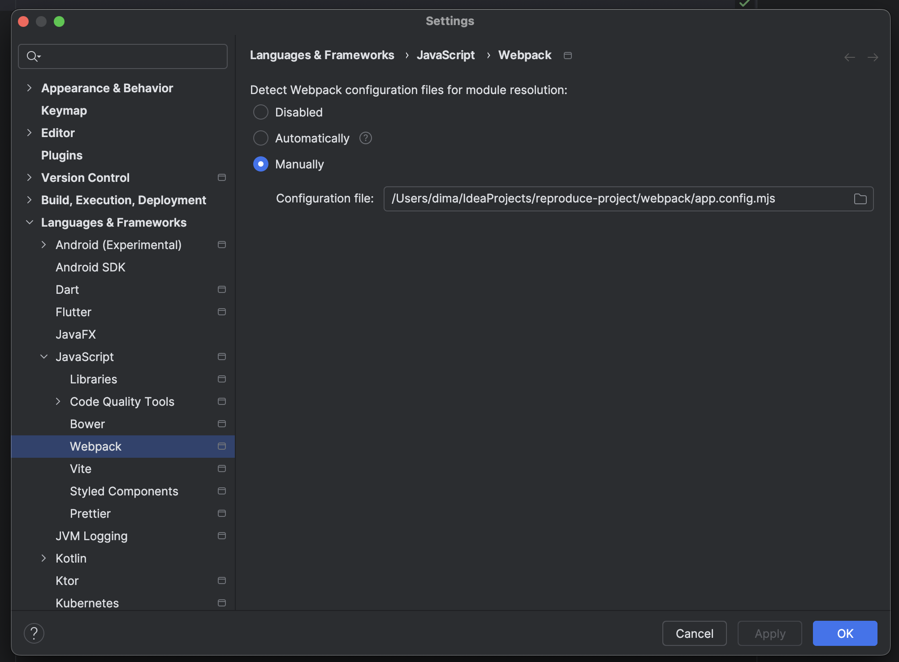
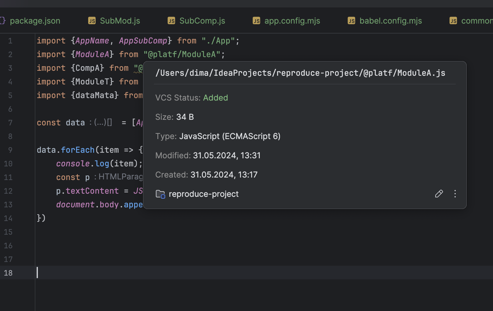
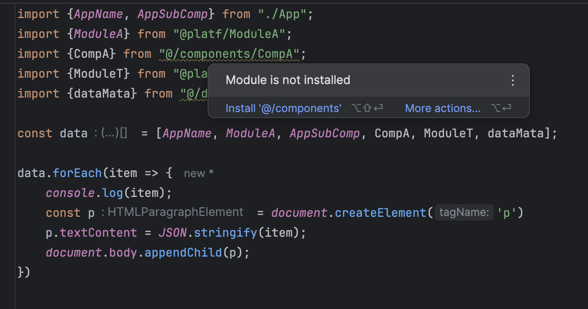

## Here are the screenshots of the problem and a minimal reproducible project.





## Idea info
```text
IntelliJ IDEA 2024.1.2 (Ultimate Edition)
Build #IU-241.17011.79, built on May 22, 2024
Licensed to Dmitriy Kozlov
Subscription is active until November 21, 2024.
Runtime version: 17.0.11+1-b1207.24 aarch64
VM: OpenJDK 64-Bit Server VM by JetBrains s.r.o.
macOS 14.5
GC: G1 Young Generation, G1 Old Generation
Memory: 4096M
Cores: 16
Metal Rendering is ON
Registry:
ide.experimental.ui=true
terminal.new.ui=true
Non-Bundled Plugins:
org.intellij.RegexpTester (2.2.0)
String Manipulation (9.14.1)
com.intellij.ml.llm (241.17011.2)
Dart (241.17502)
org.jetbrains.android (241.17011.79)
io.flutter (79.2.3)
Kotlin: 241.17011.79-IJ
```
